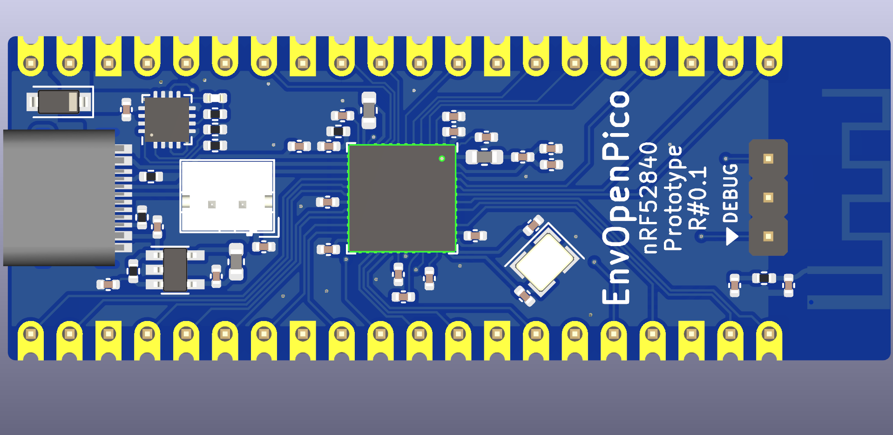

# EnvOpenPico
A nRF52840 MCU board that is in the size of a raspberry pi pico.

### Info
like the other boards Ive designed, I wanted to make sure this would fit in place of a raspberry pi pico incase you wanted wifi + bluetooth and battery on one board instead of a stack of packs for the pi pico.

this is intended to be used with my keyboards again like the other boards but ive made sure to include a decently powerful PMIC just so its capable of other things too, the BQ24072RGT should be capable of upto 1.5A output but around 500mA charging.